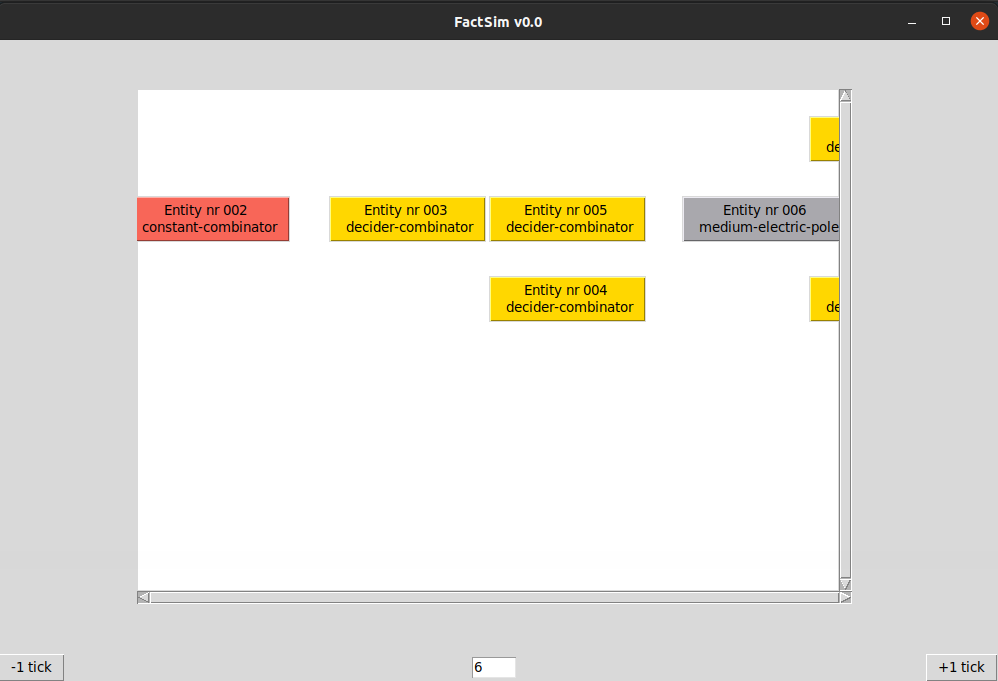

# Index

- [Factsim](#org21101d9)
- [Current features](#orgc38dd79)
- [Beware](#org9cf1b44)
- [Future](#org82765dd)
- [How to use: Detailed example](#org09c125b)
- [Thanks](#orgfaf1aaa)

# Factsim

A simulator for Factorio circuit network entities

# Current features

-   Has a basic GUI that lets you operate the circuit and examine the entities.
-   simulates the output of different componets. The components currently implemented are: -Constant combinator -Decider combinator -Arithmetic combinator -Electric poles and substation -Lamps -Pushbuttons
-   has a factsim class that can make the components interact

# Beware

-   it is not well documented (yet)

# Future

-   I'll try to add some documentation, but if you have dobts please ask, I'm very new to programming so I'm grateful for feedback.
-   I think tkinter is a bit limited as a GUI framework, ill try to get the best out of it and maybe in the future overhaul it with a different framework.

# How to use: Detailed example

You need to have python 3 installed and available in your system. Go to the folder where you downloaded the Factsim.py file. Execute the tool with `python Factsim.py`, you will be prompted to select a file. This file must contain the blueprint string saved as plain text. Once opened, the main window will present you a diagram of your circuit, you can interact clicking on the entities to see the relevant information and you can step forward and backward the simulaiton and explore the outputs of each entity on each step.

# Thanks

-   Thanks to the people from the fCPU mod discord, specially Mernon, for their motivation.
